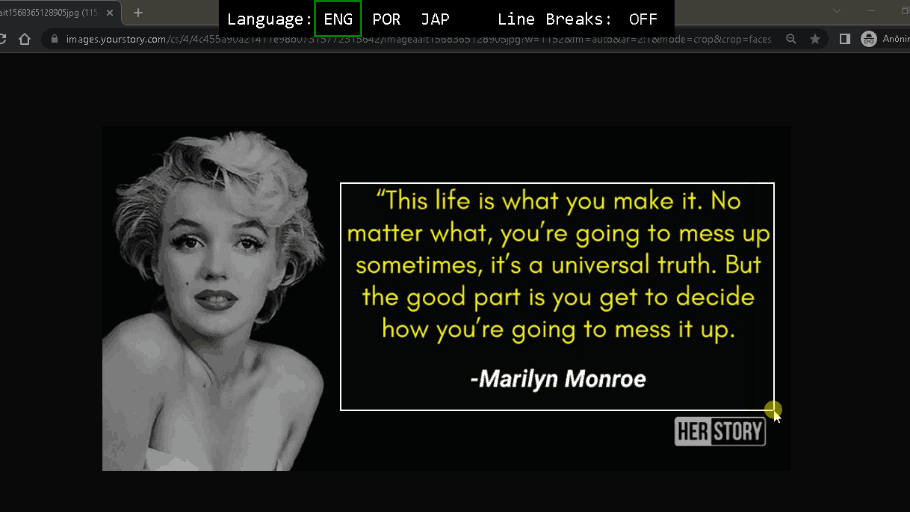

# Screenshot Digitizer
A tool for copying text from a part of the screen that is on image format.

## Screenshot

## Built with:
- [PyQt5](https://www.qt.io/)
- [Tesseract-OCR](https://github.com/tesseract-ocr/tesseract)

## How to use:
1. Install [Tesseract-OCR](https://github.com/tesseract-ocr/tesseract)
2. Make sure the path to tesseract is correct on digitizer.py
3. Execute main.py